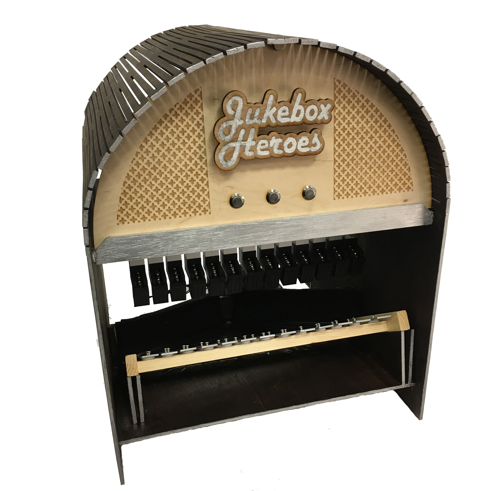

When the team was first formed and after we chose to move forward with the jukebox idea, we had to decide what kind of jukebox we would design. With the requirement of having non-trivial mechanical and software subsystems, it became clear that a modern jukebox would not have enough emphasis on the mechanical features we desired. Therefore, we introduced the classic jukebox appearance with the songs played on a simple xylophone. The only drawback of this choice was that we were limited to songs consisting of only whole notes.

After the xylophone was implemented, we decided to utilize steel marbles to hit the bars, which sounds clear notes. The marbles are released from ramps above the xylophone, which was tilted so that the marbles would only hit once per desired note. Then the marbles funnel down to a specified region so they may be returned to the top.

For aesthetic reasons, we wanted this entire process to be concealed within housing. Continuing the jukebox theme, we built a box with a semicircle on top, reminiscent of your basic jukebox look. For colors, we decided on the classic jukebox dark stained wood and chrome accents. The jukebox of heroes was born, as shown below.

