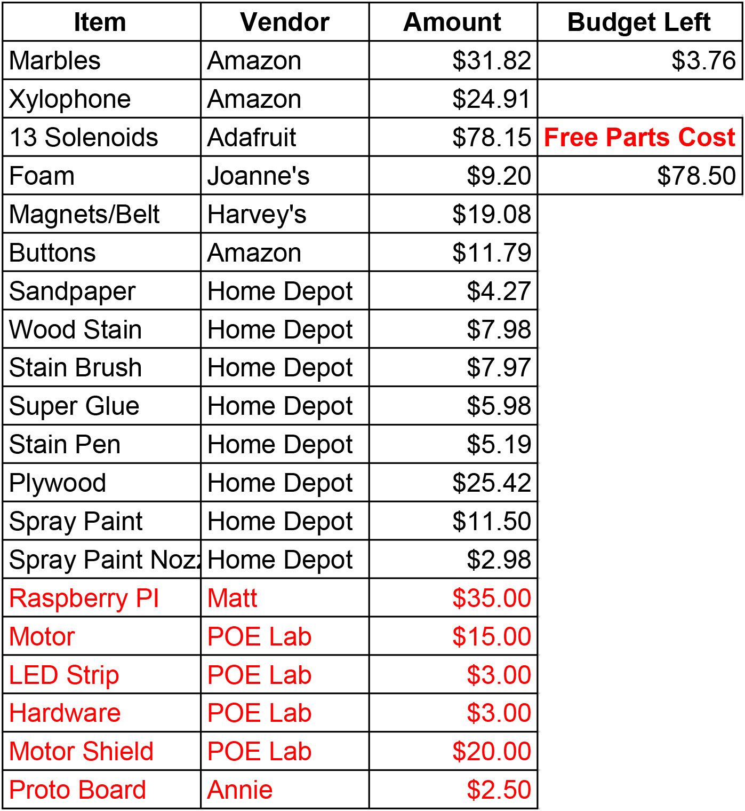

# Our Budget

Each POE team had a budget of $250. To keep track of how much we were spending and what we were buying, we made a budget spreadsheet that kept track of what the item was, who manufactured it, and how much it cost. We then tallied the total price of all of the purchased items, and made sure that with each additional purchase we stayed under $250 total. By the end of our project, we had just under $5 to spare. However, we did borrow some components from team members and the POE lab that would bring up the cost of the project by about $85. You can view the table below to get a more specific breakdown of prices.  

