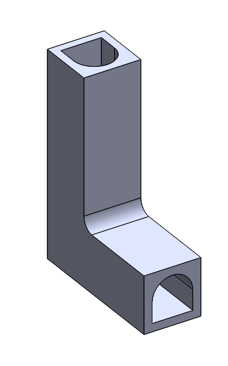
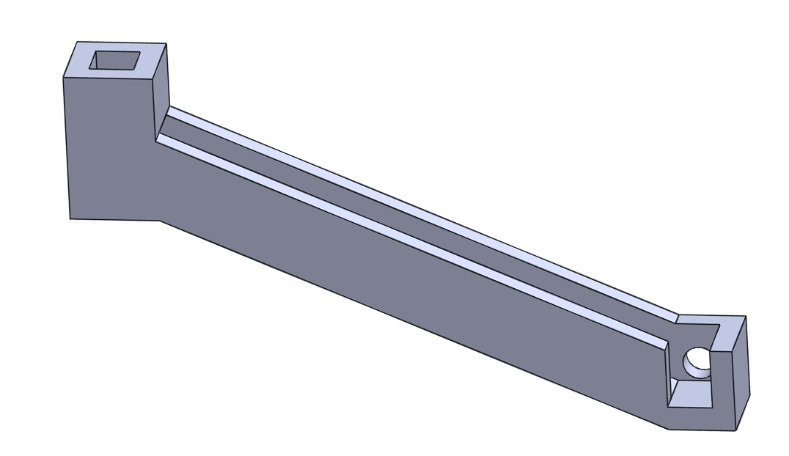
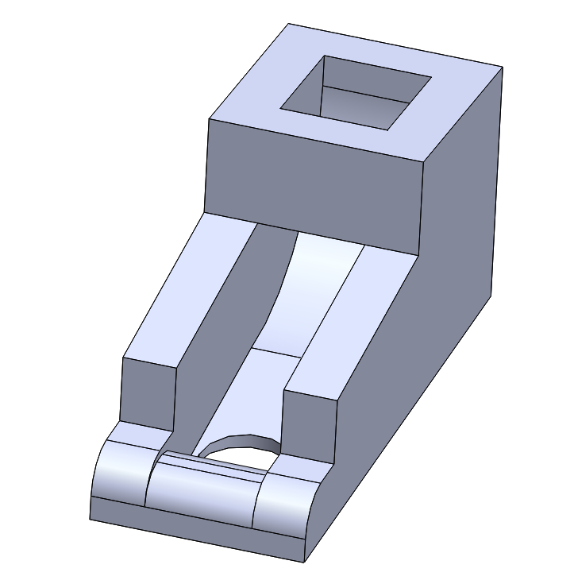
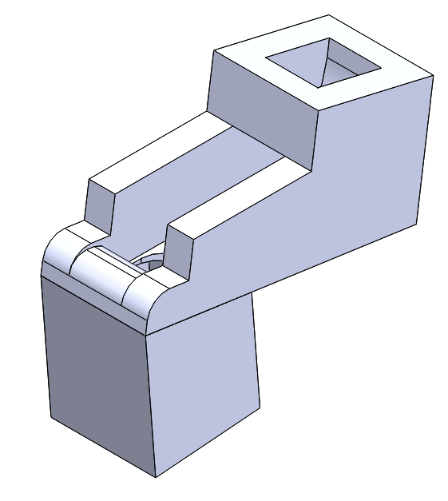

The task of releasing one marble at a time was not a trivial one. Almost everyone in the group had a turn with it, and the system went through about 20 redesigns before a successful ramp was made. The main feature that proved this mechanism’s challenge was consistency of singular release. In order to do this, we decided to use a solenoid that activates through a hole in the ramp. With this in mind, the shape of the ramp was formed.  

The initial two ramp designs were the L and the long ramp, shown above. The L lined up the marbles vertically, and the solenoid was activated from the back side. The long ramp assembled the marbles in a shallower slope that flowed downwards to the right, with the solenoid still activating from the back. When tested, both designs proved to be wildly unpredictable. Gradually, the ramp became a channel that lines the marbles up in a slope that deposits them directly forward from the above channels, as illustrated below. This allowed for consolidation of space as well as a cleaner design.  

The most important aspect of the final ramp design was the manipulation of the solenoid’s angled position. While the ramp itself proved to be a well-engineered device, it alone did not determine whether the marble release was consistent. If the angle of the solenoid was changed, all while using the same ramp, the mechanism could go from releasing one marble to five.  

At first, when we believed that the ramp alone would ensure consistency, the solenoids were attached with hot glue. While trying to determine whether the rest position of the solenoid would be extended or retracted, the solenoids would heat up and fall off if left retracted for too long. Thus, a holder was designed that angled the solenoids towards the front of the ramp, featured below, giving just enough length at full extension to push the marbles over the small hump.  

