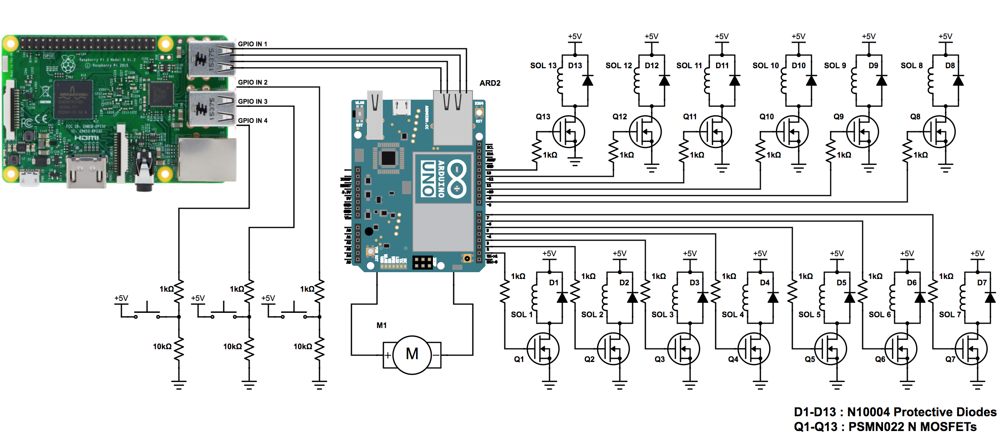
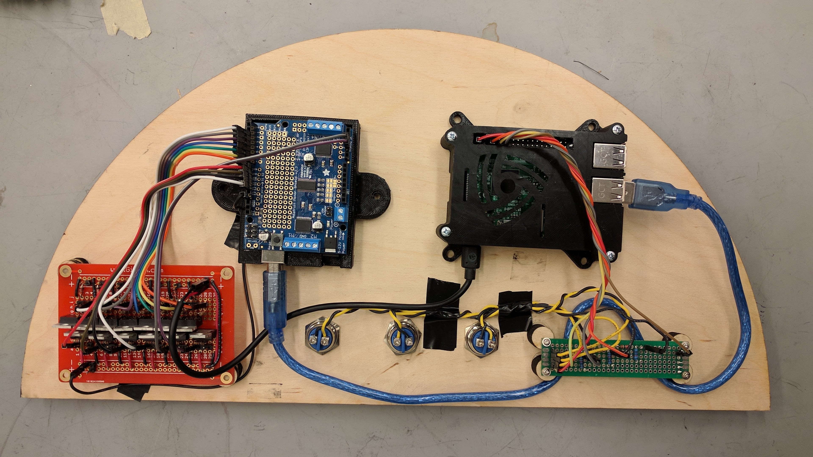

# Electrical Subsystems

## Solenoid Actuation
When initially examining the challenge of creating a mechanically played jukebox, one of our first discussions was that of actuation. After ideating over the mechanical system design that would allow us to control the release of marbles, we narrowed our design to a generic chute system of some sort with a blockage that would prevent marbles from release until we actuated the system and released a marble. Once we settled on a more refined definition of how that would work we examined whether we were interested in using a motor or a solenoid for this task. After some research it became abundantly clear that a solenoid was the right tool for the job. We then delved deeper into the specific design of the mechanical chutes interfacing with the solenoids.

Having decided to use solenoid actuators, we went about designing the circuit to control the solenoids with an Arduino. When designing the circuit our primary focus was on the current requirements of our solenoids. Solenoids require a large and sudden current draw so that they can quickly change state from retracted to extended or from extended to retracted. This quickly became an important consideration upon looking at the maximum current output of an Arduino. An Arduino can provide approximately .001 times the required current draw necessary for the solenoids. As such an additional current source is required to actuate the solenoids. We did this by hooking up a transformer to the wall that output 5V DC. This 5V line then fed into a MOSFET allowing us to control the solenoid while providing it a high current power source.

One problem with using a MOSFET to supply additional current is the presence of reverse current when trying to turn off the solenoid quickly. To prevent damage to our solenoid, we placed a diode in parallel with the solenoid. This means that if current is flowing in the correct direction, the diode will allow zero current to flow through the diode which would make the circuit act as if the diode was not even there. However, by adding a protective diode in parallel with the solenoid, when reverse current occurs, the current flows through the diode which has minimal resistance instead of the solenoid.
## Return motor
To drive the return mechanism we have chosen to use a DC motor. Similarly to solenoids, motors draw more current than the Arduino Uno can provide. As such we have used an Adafruit Motor Shield powered from the same wall power source as the solenoids. With the use of the motor shield the electrical design and software implementation is made simple. The DC motor is attached to the motor 1 channel of the motor shield which uses the two SN pins to communicate to the Arduino.
## Button Circuit

To make our jukebox a stand-alone system, we needed an onboard computer that had functionality beyond our Arduino microprocessor. This is largely necessary for MIDI processing so that our system is agile and is not hard-coded with the songs that it plays. We chose to use a Raspberry Pi 3 as the onboard computer because of its ease of use and availability. One of the main uses of the Raspberry Pi is to control which song is played by the Arduino. The song selection process is run completely on the Raspberry Pi. This system is composed of three buttons that are attached to the Raspberry Pi through USB ports. The buttons are wired such that when the button is pressed, the circuit is closed and the pins going to the Raspberry Pi USB reads high. Based on which button is pressed, the Raspberry Pi can then tell which song to have the Arduino play.
