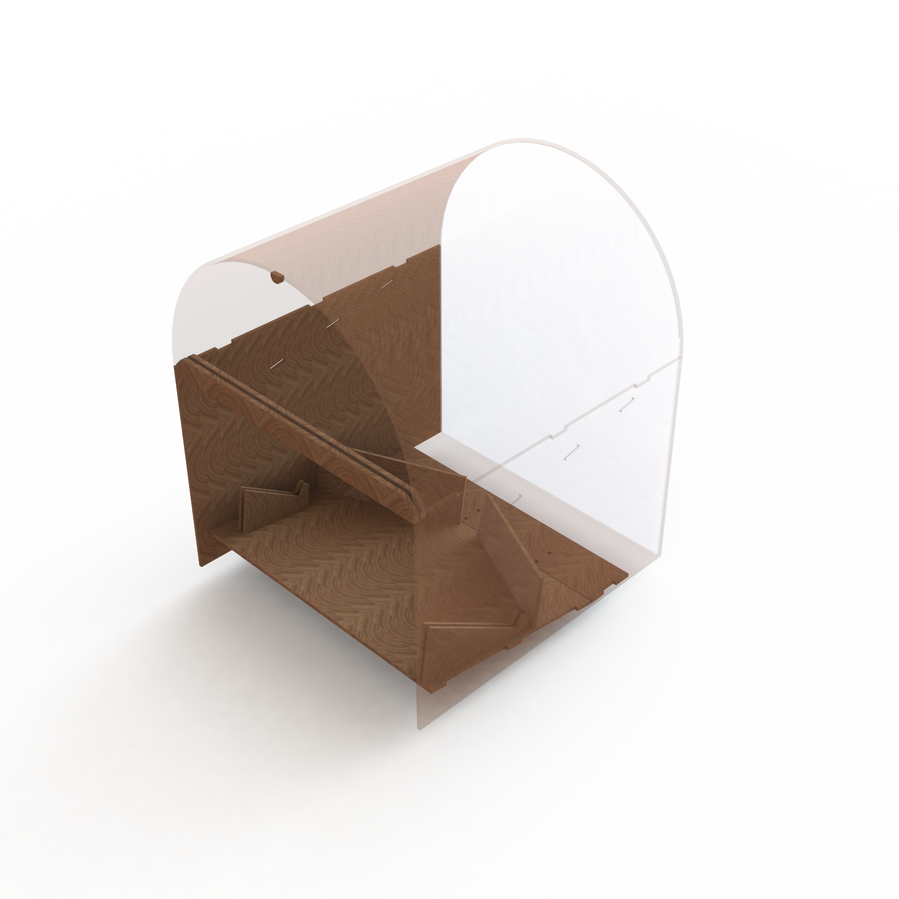

The jukebox enclosure has an upper component and a lower component within the side walls. All parts of the enclosure were laser cut out of plywood and glued together with wood glue. The upper component consists of a ramp that slopes down towards the xylophone in order to funnel all of the marbles into the marble chutes to be dropped by the solenoids. On top of this ramp, there are guiding ridges and bumpers to channel the marbles into the holes that let the marbles fall through into the chutes. The marble chutes and solenoids are mounted to the bottom of this ramp. The lower component consists of a ramp that slopes away from the xylophone in order to funnel the marbles back towards the marble return system. On this ramp, there is a layer of foam to dampen the sound of the marbles landing onto the plywood. The foam was covered in black fabric to make it a more aesthetically pleasing color than bright green. We also added strips of black electrical tape on top of the fabric to decrease the friction between the marbles and the foam so that they would successfully roll down to the return system. There are also angled ridges that the xylophone rests on so that the marbles bounce away from the xylophone towards the return system. To prevent the marbles from bouncing past the return system, there are two tall ridges covered in foam that slant towards the return system. The enclosure is shown below.

We got to our final design through iteration upon iteration. Initially, we laser cut a quick prototype out of plywood that had two sides and a top. After that design, we ideated and decided the next iteration would look more like a jukebox. This required a curved top and a larger enclosure. The ball catch system had to be sloped to move the balls to the back of the enclosure for the ball return system. This design was a little unwieldy, so we had to scale down the next design. We made the bottom of the enclosure simpler and kept the curved top in order to create the "jukebox look." Before the final enclosure design, we held a design review to make sure each part of the enclosure would complement the software and electrical systems. After some small tweaks, we had our final design.
