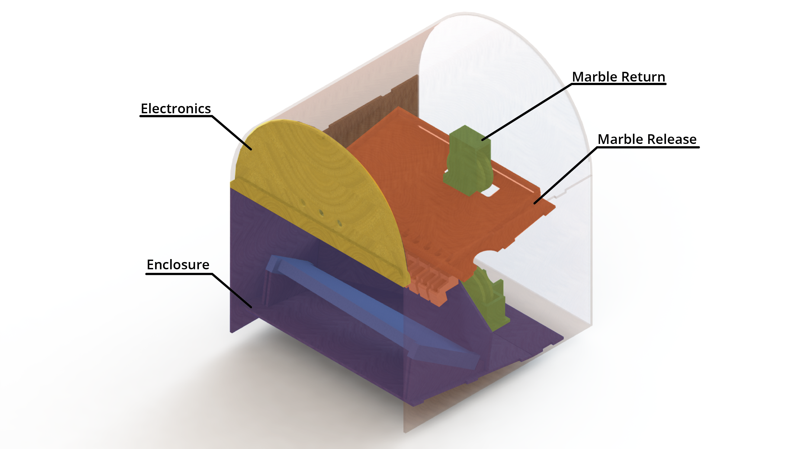

Within our jukebox, there are three mechanical subsystems: the enclosure, the marble chutes, and the marble return. The enclosure looks like a jukebox, and integrates all mechanical and electrical subsystems. The marble chutes allow the solenoids to accurately drop one marble at a time onto the corresponding xylophone note below. The marble return carries the marbles from the bottom of the enclosure to the top.  

*Our final jukebox design, as shown in CAD. This diagram shows how all the mechanical subsystems interface with each other, as well as with the front plate on which the electronics are mounted.*

Learn more about each of the components of our mechanical design:

[Marble release](/chutes) - the chutes and solenoids that actually play the notes.

[Marble return](/marble_return) - our system to return marbles to their original place.

[Enclosure](/enclosure) - what holds everything together.

[Aesthetics](/aesthetics) - How we made everything look nice.
