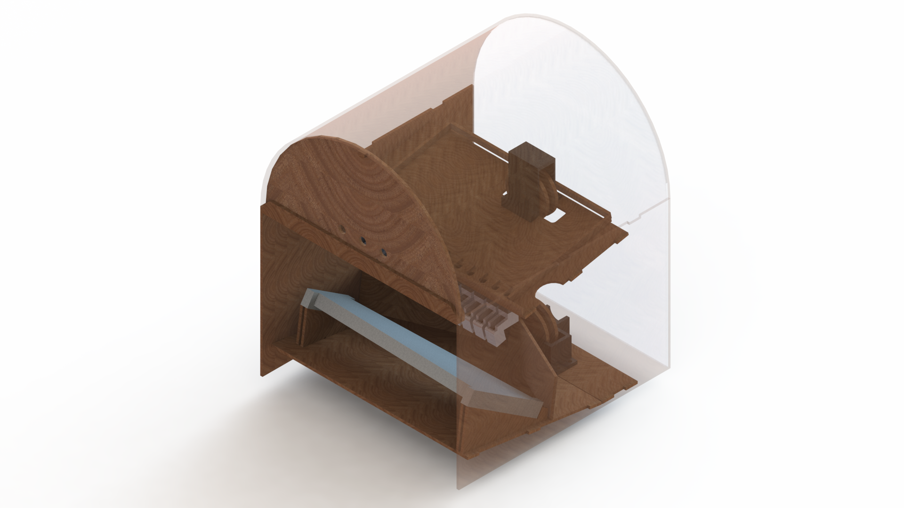

Within our jukebox, there are three mechanical subsystems: the enclosure, the marble chutes, and the marble return. The enclosure looks like a jukebox, and integrates all mechanical and electrical subsystems. The marble chutes allow the solenoids to accurately drop one marble at a time onto the corresponding xylophone note below. The marble return carries the marbles from the bottom of the enclosure to the top.  

*Our final jukebox design, as shown in CAD.*
