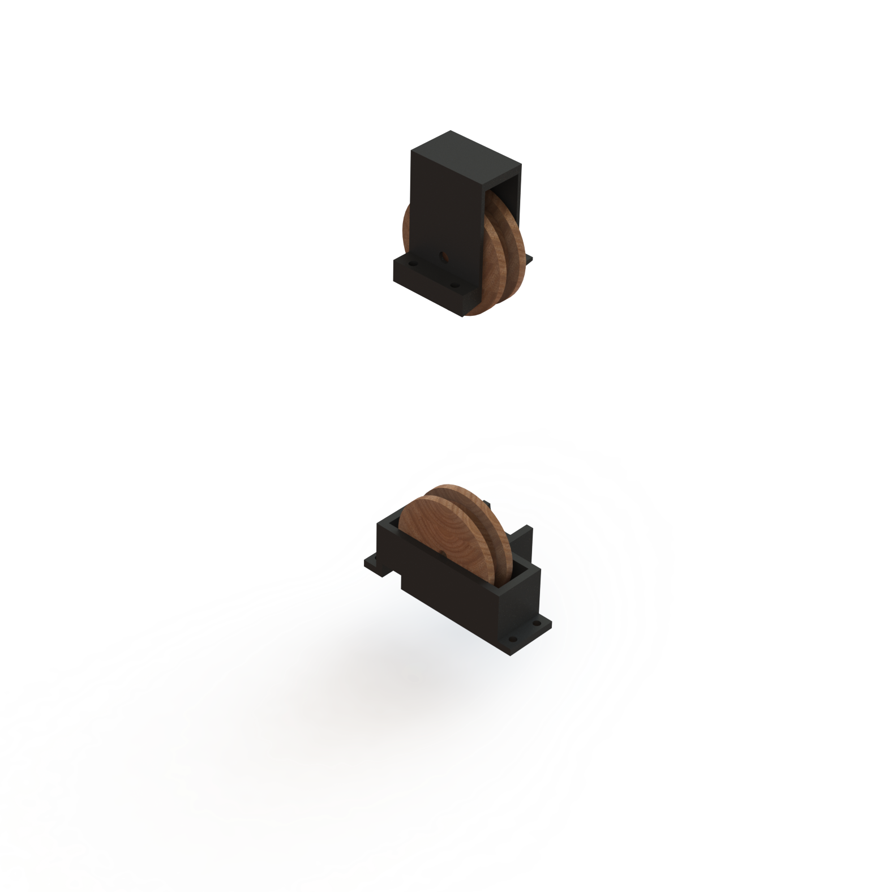

## Marble Return Mechanism

### General Concept
After analyzing the songs that we were interested in playing on our mechanical jukebox, we realized that we would not have enough marbles to play the number of notes that we wanted to play. This, combined with our desire to have our jukebox reset itself, led us to create a return mechanism. The goal of this mechanism is to return marbles that have been used back to the top of the marble run. The marble return assembly can be seen below.

### System Design
We began by looking at what the most complex song that we wanted to play was and looked at how many notes per second we were interested in playing. We found this to be about 4 notes per second. If we wanted about 3 minutes of play time, the approximate length of a complex song, we found that our return system would have to return a marble every .8 seconds. We examined a few different potential return mechanisms and settled on a belt system. Inspired by existing marble run game marble return devices, we wanted to have a belt driven by a motor on a pulley. On this belt we decided to use magnets to collect the balls at the base of our structure. While most marble return systems featured carriages that scooped the marbles up and carried them to the top, our system utilized the fact that our marbles were steel and were magnetic. We mainly chose a magnetic carriage system over a traditional carriage system for added simplicity of design and manufacturing. To remove the marbles at the top of the mechanism we again looked for a simple solution. Our final design is merely that our top pulley mount is placed such that the marbles are free to pass to on top of the upper surface but cannot pass through that surface on the way down. In this way the marbles are scraped off of the return mechanism are reset and channel into the chutes.

We chose the length of the belt and radius of the pulleys by taking the height of the marble chutes relative to the bottom of the return mechanism and adjusting the radius of the pulleys and length of the belt based upon what belt sizes were available and the rigidity of the belt. The pulley mounts were then CAD and 3D printed and the pulleys laser cut. We then attached the magnets to the belt such that, at the final speed of the belt, the magnets pass the top scraping mechanism at a rate greater than the 1 magnet per .8 seconds that we require.
