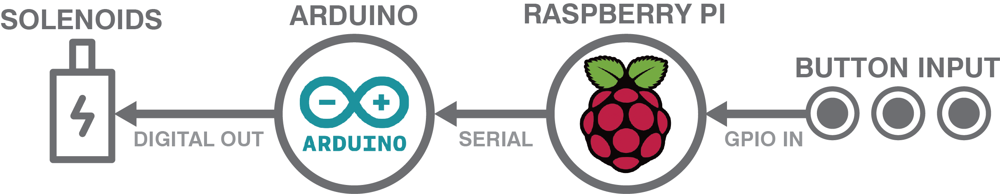
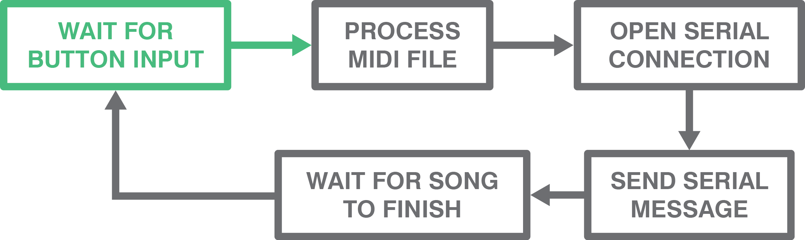

The software brings together all the components of the jukebox - taking in user input, processing the notes of the song, controlling the timing of the notes, and actuating the mechanical components to actually play the notes.

**View our code**

You can find all of our code for this project [here](https://github.com/mpbrucker/PoEJukeboxHeroes)

## Electronics System Diagram

## Software Components

**Raspberry Pi**  
The Raspberry Pi primarily handles the higher-level programming tasks. The RasPi's functionality is controlled by a C++ program that runs on startup. It uses a C++ MIDI processing library ([midifile](https://github.com/craigsapp/midifile)) to load MIDI files that are stored on the Pi and convert the notes of the MIDI file into a format that is readable by the Arduino. MIDI files are converted into the form

*0x1y1000x5y1500x6y1500x7y3000x2y*

where 'x' and 'y' are used as delimiters for the time and pin number of the note, respectively - in this example, there will be notes played at times 0, 1, 1.5, 1.5, and 3 seconds, with pins 1, 5, 6, 7, and 2, respectively. Because each note is played as a single marble drop, we only use the time of each note and ignore the duration. After parsing the MIDI file, the RasPi opens a serial connection with the Arduino (using a C++ serial library, [libserial](https://github.com/crayzeewulf/libserial)) then sends the entire song as a single string to the Arduino.

The other component handled by the RasPi is user input from buttons. The RasPi handles button functionality in order to reduce the number of ports used on the Arduino. Using [WiringPi](https://github.com/WiringPi/WiringPi), the RasPi waits for button input from the GPIO pins before doing the MIDI processing and serial communication.

**Arduino**  
The Arduino handles the functions that require precise timing - i.e., the actual playing of notes. First, it waits for input from the serial port (in practice, this is the first thing that happens anyway, since the Arduino is reset when the RasPi opens a serial connection), then parses the serial input string into the individual notes. Then, it uses the motor shield to turn on the conveyor belt motor, then loops through the list of notes and turns on the corresponding solenoid for a short period of time (~30 ms) for each note.

### Control Loop

As shown in the above diagram, the control loop on the RasPi begins by waiting for button input, then processes and sends the notes to the Arduino, then waits for the duration of the song before restarting.
