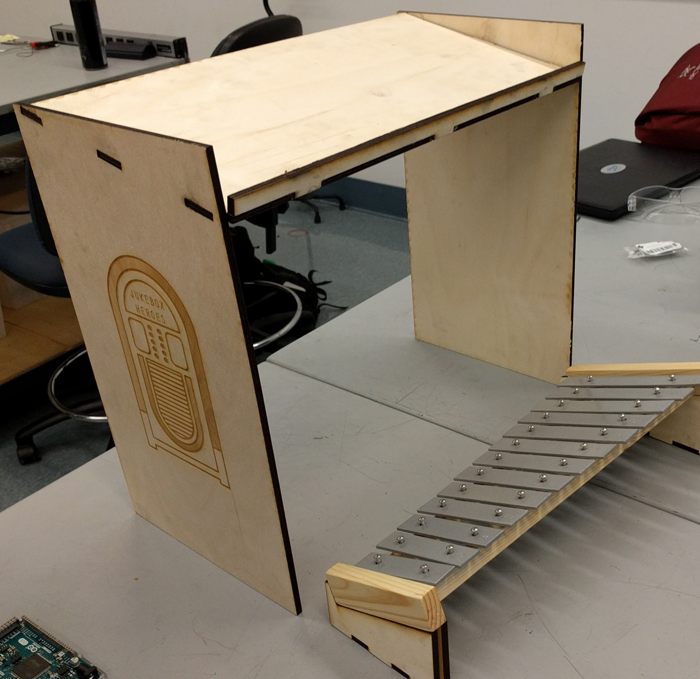
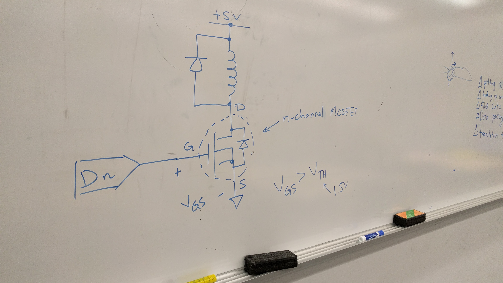
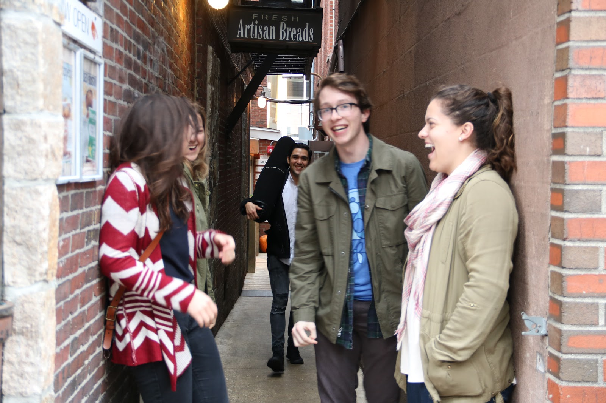
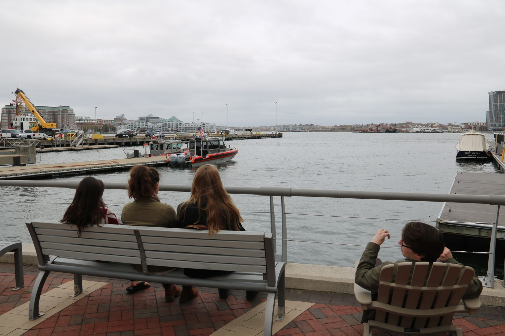

## Sprint 1
Our primary focus during this sprint was to get the mechanical specifics of launching marbles working. We knew that consistently launching marbles would prove to be a fairly difficult task, so we decided to focus our efforts on that. In addition, we wanted to integrate the electrical and basic software components to have two working marble launchers by the end of the sprint.

<iframe width="560" height="315" src="https://www.youtube.com/embed/OFr5i9Vk408" frameborder="0" allowfullscreen></iframe>

### Mechanical

Over the course of this sprint, we went through quite a few iterations of our marble launcher designs. Early into the sprint, we chose to use solenoids to actuate the marble launching, as they provide the most precise timing for launching marbles. From that point, we prototyped, CADed, and 3D printed about 6 different iterations of chute designs, eventually ending up with one that worked fairly consistently. In addition, we built a basic frame that contained the marbles in the marble hopper, held the xylophone, and attached to the marble chutes. The primary issue we encountered mechanical-wise in this sprint was actuation; the solenoids had consistency issues with launching balls, and they also heated up very quickly due to always drawing current.

### Electrical

The electrical design during this sprint was very straightforward. Since our main task was to get ball launching working, the main electrical concern was how to actuate the solenoids. Fortunately, we were able to figure out a design that uses an N-channel MOSFET to actuate the solenoids, and using an external power supply, it was a fairly simple process to actuate them using the Arduino.

### Software

This sprint, we were able to get the basic note playing working via an Arduino. We began by writing code to process messages from the Arduino's serial port, then using that message to actuate the solenoids at given times. We got a basic version working, but with some issues: we weren't able to get more than one note to play simultaneously, and every note still had to be manually input through the Arduino's serial monitor. We also wrote some preliminary code in C++ to process MIDI files and send them to the Arduino through serial.

## Sprint 2

At the end of the first sprint, we set a team kaizen for Sprint 2. We decided that each team member would be assigned to a certain task or system as a "point person." We also edited our Minimum Viable Product to make it more specific; it included being able to play "Twinkle, Twinkle, Little Star" hard-coded and using a magnetic return system to reset the marbles. After assessing our biggest technical risks, we decided that the marble chutes would be the best component to face for this sprint.

### Mechanical

##### Sprint 2 Deliverable

Mechanical jukebox that plays **six** notes by dropping marbles on a xylophone at a rhythm determined by a **user-selected MIDI file**, with an enclosure and **ball catch system**.

On the mechanical side, we had to 3D print six of the marble chutes to play the six notes necessitated by the deliverable. The final marble chute design, chosen after tens of iterations, is in the picture next to the enclosure. The enclosure was built to mimic the classic style of a jukebox. Its bottom plate was sloped with ridges to allow the marbles to run down to a single pick-up point (for the marble return system) after hitting the xylophone. The top platform the chutes mounted to had ridges to push the marbles toward the holes and into the chutes.

In addition to the marble chutes and the enclosure, we addressed the marble return system and designed basic pulleys and mounts for the pulleys. We also purchased a belt to use to pick up the marbles, but did not complete integration of this component due to our decision to focus our efforts on the biggest technical risk we identified. Lastly, we did research into options for sound dampening because the marbles bounced on the plywood and made noise that distracted from the notes being played. After testing cork, we decided that foam was the best choice and set that aside for the Sprint 3.

### Electrical

The most important aspect of electrical system during Sprint 2 was scalability. Going from one chute to six chutes required more circuits on the breadboard. In the image above, the six circuits can be seen, including transistors, diodes, and resistors. Most of our learning goals address aesthetic design in one way or another, so we also worked on wiring the circuits in an organized and color-coded fashion.

### Software

A significant issue with the software system after Sprint 1 was its inability to play more than one note at a time. We fixed this problem in Sprint 2 and also edited the code so that serial streaming from the computer works fully. Finally, we were able to successfully process MIDI files and used a MIDI file to play "Twinkle, Twinkle, Little Star" for the sprint review. The software converts a MIDI file into a series of notes that are streamed via serial to the Arduino.

### Team Health

After spending all of Sprint 1 working together, we decided we needed a bonding activity outside of the PoE room. We went into Boston and explored the city, had some tasty pastries, had a few impromptu photoshoots, and even bought some holiday candles.

### Issues

We were not able to work on the marble return system as much as we would have liked in this sprint. We had ideas, made some purchases, and designed a few prototypes, but did not have a solid idea of how the subsystem would work in conjunction with the rest of our mechanical system. For this reason, we chose the return system to be our biggest technical risk for the next sprint.

Although we chose to split the work up based on who was the point person for a specific task or system, our communication lacked in this sprint. We had not clearly defined the roles and responsibilities of a point person, so each of us made design decisions and without necessarily informing the rest of the team. This made integration difficult because we had different expectations. Our kaizen for this sprint was to communicate before subsystems before committing to a design so that we would all be on the same page before moving forward.

## Sprint 3 (Minimum Viable Product)

To address our kaizen from Sprint 2, we defined what a point person can do and who makes final decisions on the first day of Sprint 3 and also held two design reviews. Our first design review evaluated the mechanical structure. By the end of Sprint 3, we needed our MVP, so we wanted to have a polished structure that we had all given feedback on. To make final decisions, we discussed our options as a group.

### Mechanical

For this sprint, we continued polishing and integrating all of our subsystems. We also spent more time iterating on the magnetic return system. The final assembly of the system as portrayed in SolidWorks is shown below:

### Electrical

### Software

### Team Health

Dedicated to having a positive work environment, we made an anonymous survey for each of us to fill out with questions prompting "I like" and "I wish" statements. We discussed the results of this survey in one of our meetings and decided how we could address the negative aspects of our teaming process. One of the results of this was the "All-Play" part of our meetings. Before breaking off into individual tasks during meetings, we sat down and had an "All-Play," during which we brought up concerns relevant to the entire team and spoke about topics that we all needed to give feedback on.

### Issues

## Sprint 4 (Stretch Goals)

Once we achieved our MVP, we were able to move on to our stretch goals and improvement of the aesthetic of our overall design. We defined our stretch goals in Sprint 1 and refined them in Sprint 2:

- Percussion incorporation
- Having multiple songs to play
- Using buttons to select a song
- Process MIDI files automatically

### Mechanical

### Electrical

In Sprint 3, we ordered buttons with the intention of including the in our structure for the final deliverable. The three buttons were incorporated in the electrical system and the software system controlled by the Raspberry Pi. We were able to make the button play "Twinkle, Twinkle, Little Star" and hope to use the other two to choose from a list of songs.

### Software

On the software side, we programmed the Raspberry Pi to process user-selected MIDI files automatically. The information from the MIDI file is parsed and sent to the Arduino, which controls the solenoids and hits the marbles onto the xylophone in the rhythm of the tune. This program can parse any MIDI file chosen by the user; its flexibility made it an attractive choice for a stretch goal because it works well with our other goal involving our jukebox being able to play multiple songs.

### Team Health

For the first week of the sprint, we planned another team bonding activity in Boston. Our team outing in Sprint 2 went very well and increased our productivity, so we wanted to do something similar in this sprint.

### Issues
