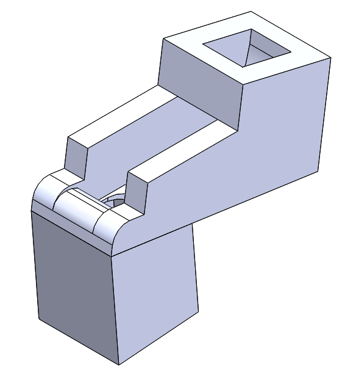

# Project Overview  
For this project, we were presented with the task of designing a mechatronic system. This system must include both a nontrivial mechanical system design and fabrication and a nontrivial electronic system involving hardware and firmware aspects. Based off of these instructions, every student taking Principles of Engineering filled out a teaming survey that had questions about which project ideas the students were interested in and what teaming and engineering skills they have. Using those responses, teams of three to five members were formed, and thus Jukebox Heroes was born. We all shared an interest in making a jukebox of some sort. Since three of our members are mechanical engineers, we decided to move forward with a more mechanical jukebox.

## Sprint 1
Our primary focus during this sprint was to get the mechanical specifics of launching marbles working. We knew that consistently launching marbles would prove to be a fairly difficult task, so we decided to focus our efforts on that aspect of the design. In addition, we wanted to integrate basic electrical and software components to have two working marble launchers by the end of the sprint.  

<iframe width="560" height="315" src="https://www.youtube.com/embed/OFr5i9Vk408" frameborder="0" allowfullscreen></iframe>

##### Sprint 1 Deliverable

A **marble holder** with **two** chutes which launch marbles at a xylophone to a rhythm **manually input** by the user.  

### Mechanical

Over the course of this sprint, we went through quite a few iterations of our marble launcher designs. Early into the sprint, we chose to use solenoids to actuate the marble launching, as they provide the most precise timing for launching marbles. From that point, we prototyped, CADed, and 3D printed approximately 6 different iterations of chute designs, eventually ending up with one that worked fairly consistently. In addition, we built a basic frame that contained the marbles, held the xylophone, and attached to the marble chutes.  

The primary mechanical issue we encountered in this sprint was actuation; the solenoids were inconsistently launching marbles and they also heated up very quickly due to how much current they drew. As they became hotter, the glue we used to attach them to the chutes melted and the solenoids detached.  

### Electrical

The electrical design during this sprint was very straightforward. Since our main task was to get ball launching working, the main electrical concern was how to actuate the solenoids. Fortunately, we were able to figure out a design that uses an N-channel MOSFET to actuate the solenoids, and using an external power supply, it was a fairly simple process to actuate them using the Arduino.  

### Software

This sprint, we were able to get the basic note playing working via an Arduino. We began by writing code to process messages from the Arduino's serial port, then utilized that message to actuate the solenoids at specified times. We got a basic version working, but not without issues. We were unable to get more than one note to play simultaneously and every note still had to be manually input through the Arduino's serial monitor. We also wrote some preliminary code in C++ to process MIDI files and send them to the Arduino through serial.  

## Sprint 2

Upon concluding Sprint 1, we established a team kaizen to keep in mind for Sprint 2. We assigned each team member to a certain task or system as a "point person." We also edited our Minimum Viable Product (MVP) description to make it more specific. To know we had achieved our MVP, we wrote that the jukebox would be able to play "Twinkle, Twinkle, Little Star"  hard-coded and use a magnetic return system to reset the marbles. After assessing our biggest technical risks, we decided that the marble chutes would be the best subsystem to face head-on in this sprint.  

<iframe width="560" height="315" src="https://www.youtube.com/embed/P3kJNiBI5nI" frameborder="0" gesture="media" allow="encrypted-media" allowfullscreen></iframe> 

##### Sprint 2 Deliverable

Mechanical jukebox that plays **six** notes by dropping marbles on a xylophone at a rhythm determined by a **user-selected MIDI file**, with an enclosure and **ball catch system**.  

### Mechanical

On the mechanical side, we had to 3D print six marble chutes to play the six notes mandated by our deliverable. The final marble chute design, chosen after tens of iterations, is shown by the picture adjacent to the enclosure. The enclosure was built to mimic the classic style of a jukebox. Its bottom plate was sloped with ridges to allow the marbles to run down to a single pick-up point (for the marble return system) after hitting the xylophone. The top platform the chutes mounted to had ridges to push the marbles toward the holes and into the chutes.  

In addition to the marble chutes and the enclosure, we addressed the marble return system and designed basic pulleys and mounts for the pulleys. We also purchased a belt to use to pick up the marbles, but did not complete integration of this component due to our decision to focus our efforts on the biggest technical risk we identified. Lastly, we did research into options for sound dampening because the marbles bounced on the plywood and made noise that distracted from the notes being played. After testing cork, we decided that foam was the best choice and set that aside for the Sprint 3.  

### Electrical

The most important aspect of electrical system during Sprint 2 was scalability. Going from one chute to six chutes required more circuits on the breadboard. In the image above, the six circuits can be seen, including transistors, diodes, and resistors. Most of our learning goals address aesthetic design in one way or another, so we also worked on wiring the circuits in an organized and color-coded fashion.  

### Software

A significant issue with the software system after Sprint 1 was its inability to play more than one note at a time. We fixed this problem in Sprint 2 and also edited the code so that serial streaming from the computer works fully. On the software side, we programmed the Raspberry Pi to process user-selected MIDI files automatically and were able to play "Twinkle, Twinkle, Little Star" for the sprint review.  

The software converts a MIDI file into a series of notes that are streamed via serial to the Arduino, which controls the solenoids and hits the marbles onto the xylophone in the rhythm of the tune. This program can parse any MIDI file chosen by the user; its flexibility made it an attractive choice for a stretch goal because it works well with our other goal involving our jukebox being able to play multiple songs.  

### Team Health

After spending all of Sprint 1 working together, we decided we needed a bonding activity outside of the PoE room. We went into Boston and explored the city, had some tasty pastries, had a few impromptu photoshoots, and even bought some holiday candles.  

### Issues

We were not able to work on the marble return system as much as we would have liked in this sprint. We had ideas, made some purchases, and designed a few prototypes, but did not have a solid idea of how the subsystem would work in conjunction with the rest of our mechanical system. For this reason, we chose the return system to be our biggest technical risk for the next sprint.  

Although we chose to split the work up based on who was the point person for a specific task or system, our communication lacked in this sprint. We had not clearly defined the roles and responsibilities of a point person, so each of us made design decisions and without necessarily informing the rest of the team. This made integration difficult because we had different expectations. Our kaizen for this sprint was to communicate before subsystems before committing to a design so that we would all be on the same page before moving forward.  

## Sprint 3 (Minimum Viable Product)

To address our kaizen from Sprint 2, we defined what a point person is responsible for and how we should make final design decisions on the first day of Sprint 3. To highlight a couple key changes in our teaming process, we held two design reviews (one for the mechanical systems and one for aesthetics) and planned a team health discussion, which is described further in the Team Health section. Our first design review evaluated the mechanical structure and allowed us to all give feedback on the final designs of our various subsystems. The purpose of the aesthetics design review was to ensure we all had a clear vision of what our product would look like.  

<iframe width="560" height="315" src="https://www.youtube.com/embed/a6WiX90mLuc" frameborder="0" gesture="media" allow="encrypted-media" allowfullscreen></iframe>

##### Sprint 3 Deliverable

A **button-operated** jukebox with **13** marble chutes that plays **"Twinkle, Twinkle, Little Star" by launching marbles onto a xylophone with a magnetic return system**.  

### Mechanical

For this sprint, we continued polishing and integrating all of our subsystems. We focused a lot of effort on iterating upon the magnetic return system in addition to perfecting the design of the marble chutes and solenoid holders:  

Our MVP included a more reliable marble chute system, a ball catch and return system, and a more fully fleshed out structure. The final assembly of the system as portrayed in SolidWorks is shown below:  

Mechanical Design Decisions:  

* Belt type:  
  * Thick vs. **thin**  
  * Sprocket vs. **pulley**  

We examined belt size and pulley size in order to have a properly tensioned belt that cycles marbles from the bottom of the enclosure to the top. We chose the belt and pulley sizes based on available belt lengths and the distance between the marble collection system and the top marble plate. Due to our choice for the type of belt, the availability of belt lengths was limited. We weighed the pros and cons of a v-belt (a very thick belt), a timing belt (a belt with horizontal grooves), and a serpentine belt (thin belt) and ultimately decided to use a serpentine belt for its flexibility in conjunction with a simple pulley for driving.   

* Scraping mechanism:  
  * **Simple** vs. wiper  

For the duration of this sprint, we were interested in a rudimentary marble scraping mechanism for removing the marbles from the belt at the top of the system. We aimed for simplicity here and made the scraping mechanism a specifically sized hole in the top marble plate that passively removed marbles from the belt as they passed through. The design of this slot had not been optimized for marble removal, thus making it a notable task for Sprint 4.
The wiper design was more time-intensive and for this sprint, we decided not to use it. The ball return system was functional, but it was not as efficient as we envisioned it.  

* Motor choice:  
  * **Torque** vs. speed  

 We tested two different motors and determined that opting for the motor with more torque and less speed was most suitable for the marble return system.  

The biggest technical risk we identified moving forward into Sprint 4 was the marble return system. After running our MVP through multiple tests, we decided there needed to be a back railing on the upper portion of the structure to keep marbles from falling backward instead of rolling toward the chutes. This detail was added to our Sprint 4 deliverable. The scraping mechanism we opted for in this sprint was simple. Due to its simplicity, it was also unreliable and the marbles were not evenly dispersed between chutes. Our solution for this concern was to perform longer periods of testing of the ball return and to use a wiper to disperse the marbles more evenly among the chutes.  

### Electrical and Software

After completing our Minimum Viable Product, our software system could parse multiple MIDI files and play them on the Raspberry Pi. The button song selection code worked and was fully integrated with the button circuit. Finally, we moved the solenoid actuation circuit from the breadboard to a protoboard with rails. Many of our team members had learning goals related to learning and practicing soldering techniques, so they worked on soldering parts of both of the circuits.  

### Team Health

Dedicated to having a positive work environment, we made an anonymous survey for each of us to fill out with questions prompting "I like..." and "I wish..." statements. We discussed the results of this survey in one of our meetings and decided how we could address the negative aspects of our teaming process. One of the results of this was the "All-Play" part of our meetings. Before breaking off into individual tasks during meetings, we sat down and had an "All-Play," during which we brought up concerns relevant to the entire team and spoke about topics that we all needed to give feedback on.  

### Issues

The most significant issues of this sprint besides the major technical risk were what we designate as "Teamwork Takeaways:"  

# Sprint 4 (Aesthetics and Beyond)

##### Sprint 4 Deliverable

A **wood stained** jukebox with **chrome accents** that **utilizes all 13 chutes** by playing multiple songs and has a **scraping mechanism** with a **back railing.**  

Once we achieved our MVP, we were able to move on to our stretch goals and improving the aesthetic of our overall design. Our inspiration for this look came from classical, wooden jukeboxes:  

 We defined our stretch goals in Sprint 1 and refined them in Sprints 2 and 3:  

* LED lighting behind the front panel logo  
* Match classical jukebox aesthetics  
* Ability to play multiple songs  
* Ability to press buttons to select different songs  
* Automatic MIDI file processing  

By the time we presented our Minimum Viable Product, we had achieved 3/5 of our stretch goals. Our jukebox played the expected "Twinkle, Twinkle, Little Star" as well as "Three Blind Mice" and "Mary Had a Little Lamb."  

### Mechanical

To attain our deliverable, we designed a better scraping mechanism and added a back railing to the jukebox structure to prevent marbles from falling off the top platform.  We decided against marble channeling, but did design small triangular pieces to add onto the top platform in order to ensure that only one marble was entering a chute at a time.

### Electrical and Software

For the electrical and software systems, we worked on organizing and cleaning up the wiring for the various circuits and solenoids.  After consolidating power sources, our jukebox now needs two power sources instead of three. The last task we addressed was further detailing our documentation of the two systems.  

### Aesthetics

This time around, we spent more time on our jukebox's look. After sanding the entire structure, we spray painted specific ridges on the darkly stained enclosure to evoke feelings of nostalgia in our users. We rastered our names onto a small piece of plywood to attach to the side of the jukebox to as our final mark on our project.

### Team Health

For the second week of the sprint, we planned another team bonding activity in Boston. Our team outing in Sprint 2 went very well and increased our productivity, so we wanted to do something similar in this sprint. We also recognized that we would be in the throes of finals season and knew we would need a mental break.  
