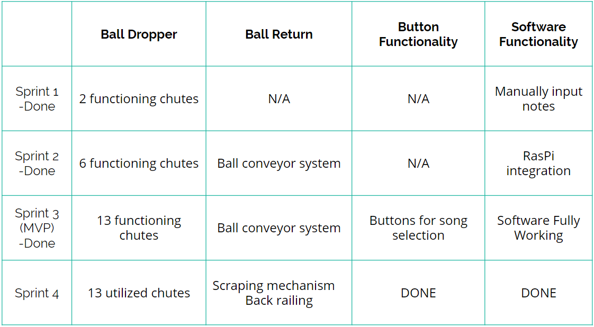

## Timeline

In order to produce our MVP and ensure we reasonably paced our progress, we broke down our project into different subsystems. For each sprint, we decided on end goals for subsystem components we wanted to have completed by the sprint review. The subsystems and corresponding tasks for each of the sprints are shown below:

